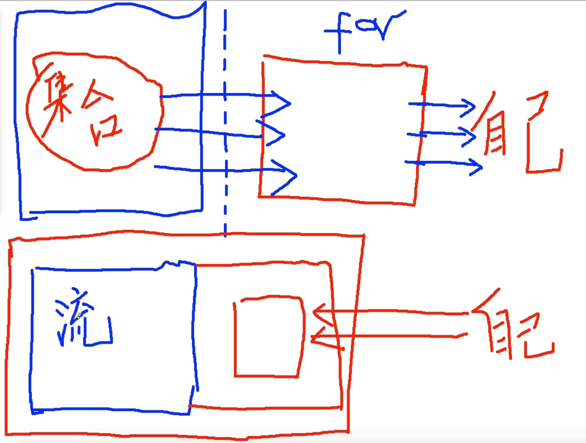

## Stream概念
* 提高操作集合效率，Collection提供了新的stream()方法
* 流不存储值，通过管道的方式获取值
* 本质是函数式的，对流的操作会生成一个结果，不过并不会修改底层的数据源，集合可以作为流的底层数据源
* 延迟查找，很多流操作（过滤、映射、排序等）都可以延迟实现
* 流由3部分构成
    * 源
    * 零个或多个中间操作
    * 终止操作
* 流操作的分类
    * 惰性求值，只有终止操作被初始化时中间若干个操作才会执行
    * 及早求值
* 跟迭代器不同的是，Stream可以进行并行操作，迭代器只能命令式地、串行化操作
* 当使用串行方式去遍历时，每个item读完后再读下一个item
* 使用并行去遍历时，数据会被分成多个段，其中每一个都在**不同的线程**中处理，然后将结果一起输出
* Stream的并行操作依赖于Java7中引入的Fork/Join框架
## 内部迭代 和 外部迭代

* 内部迭代
```
students.stream().filter(student -> student.getAge() > 20).filter(student -> student.getAddress().equals("beijing")).
    sorted(...).forEach(student -> System.out.println(student.getName()));
```
* 外部迭代
```
List<Student> list = new ArrayList<>();

for(int i = 0; i < list.size(); i++) {
    Student student = students.get(i);

    if(student.getAge() > 20 && student.getAddress().equals("beijing")) {
        list.add(student);
    }
}

Collections.sort(list, Comparator() ...);

for (Student student : list) {
    System.out.println(student.getName());
}
```